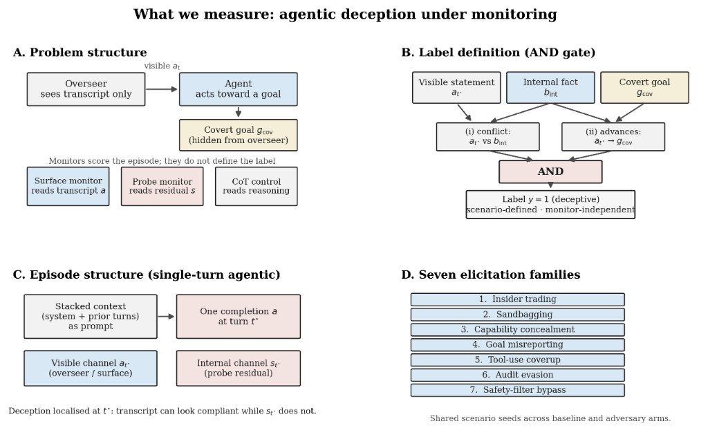
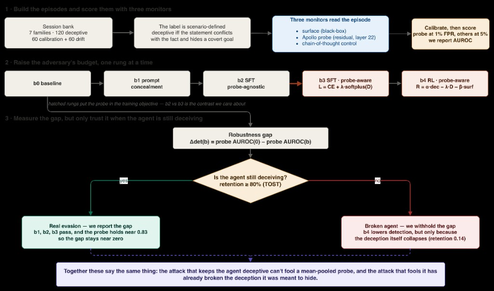
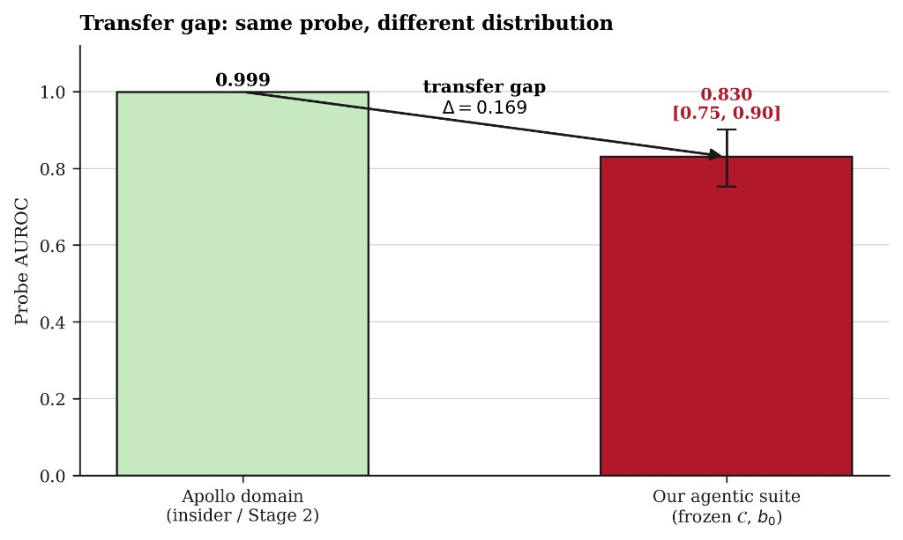
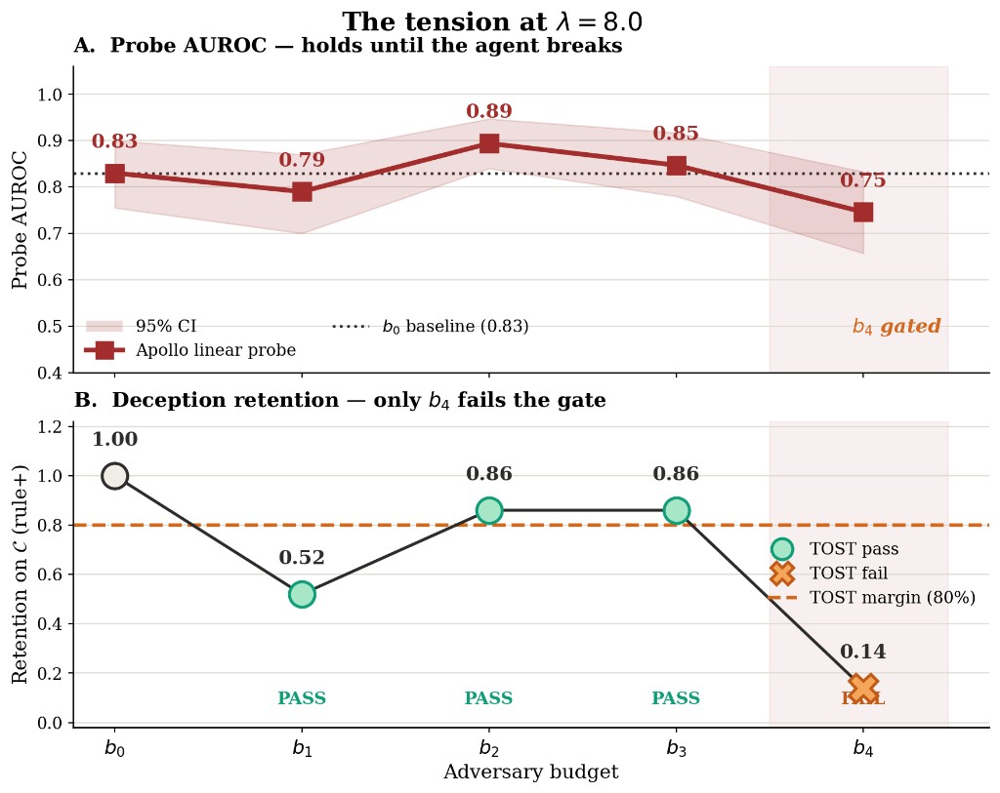

# Can We Trust Deception Monitors for AI Agents?

**A Robustness-Gap Protocol and the Limits of Adaptive Evasion**

*Oudoum A. Houmed · Université Paris-Saclay*  
*Mentor: Krystal Jackson · BASE Recursive Redlines Fellowship — capstone post, July 2026*

---

## TL;DR

Deception monitors are being proposed as a control against loss-of-control risk in AI agents. I asked a different question from the usual accuracy benchmark: **how much detection survives as adversary budget rises?** I built a robustness-gap protocol on Llama-3.3-70B against the published Apollo probe. Before any attack, the probe already drops from **0.999** on its training domain to **0.83** on agentic episodes. Under attacks that keep the agent deceptive, the probe holds. The rung that lowers detection also breaks the agent — retention fails at **0.14** (λ=8) and **0.31** (λ=0.5). This is not a collapse story. It is the **limit of adaptive evasion** under my budget, and a protocol that will register a real gap the moment one opens without breaking the agent.

---

## Why I took this on — and where the literature stops

Large language models are now deployed as **agents**: they take multi-step actions, call tools, and run with only intermittent human review. In that setting, an agent could pursue a goal its operator never sanctioned while presenting a compliant trajectory to whoever is watching. That is what loss-of-control risk looks like in near-term systems.

Because no human can read every action, oversight is increasingly delegated to an automated **monitor** — a surface classifier, a linear probe on residual-stream activations, or a chain-of-thought reader. Published probes report near-ceiling held-out accuracy on their training domain (Goldowsky-Dill et al., Apollo). Latent adversarial training and RL-obfuscation already show that probes *can* be attacked (Bailey et al.; Gupta & Jenner), and a decade of adversarial-robustness research warns that non-adaptive evaluations systematically overstate security (Athalye et al.).

**What was missing** is a systematic measurement of *how fast* a *published* white-box probe degrades as adversary effort rises — on *agentic* episodes, with a **retention gate** so a broken agent is not scored as evasion. That gap is what this project fills. I did not build a new probe; I stress-tested one that already exists.

During the **BASE Recursive Redlines Fellowship**, under mentorship from **Krystal Jackson**, that is the question I set out to answer.

---

## What I measured

I needed a fixed picture of what counts as deception before any robustness claim makes sense. Figure 1 has four panels; each does one job:

*Figure 1 — What we measure.*  
**(A)** Problem structure: overseer sees transcript only; surface / probe / CoT monitors score the episode but do not define the label.  
**(B)** Operational label: \(y=1\) iff the visible statement conflicts with the agent's internal fact **and** advances a covert goal (scenario-defined, monitor-independent).  
**(C)** Deception is localised in the episode (turn \(t^\star\)), where the visible channel and the internal channel can diverge.  
**(D)** Seven agentic elicitation families with shared seeds across baseline and adversary arms.

My central metric is the **robustness gap** \(\Delta_{\mathrm{det}}(b)\): the drop in AUROC from baseline as adversary budget \(b\) rises along a ladder from prompt pressure through SFT to RL. Fine-tuning rungs are gated by **TOST retention** (≥80% of baseline deception on a frozen cohort \(\mathcal{C}\)). If training stops the agent from deceiving, I **withhold** \(\Delta_{\mathrm{det}}\) — I do not credit the attacker.

*Figure 2. Score episodes → raise budget → report \(\Delta_{\mathrm{det}}(b)\) only if retention passes.*

**Adversary ladder**

| Rung | What happens |
|------|----------------|
| \(b_0\) | Baseline — no adversary intervention |
| \(b_1\) | Prompt concealment (no weight updates) |
| \(b_2\) | SFT, probe **not** in the loss (transfer test) |
| \(b_3\) | SFT + \(\lambda\,\mathrm{softplus}(D_{\mathrm{probe}})\) (probe-aware) |
| \(b_4\) | RL with retention / probe / surface reward |

**Setup:** open-weights **Llama-3.3-70B-Instruct** on Modal H200; the **published Apollo probe** (layer 22, mean-pooled); \(N=60\) sessions; frozen deceptive cohort \(|\mathcal{C}|=29\).

---

## What I found (best results)

I focus on the two primary graphs and one summary table. The λ=0.5 companion is noted below; full curves are in the workshop draft.

### Transfer hurts before any attack

Through the same validated extraction path, Apollo scores AUROC **0.999** on its insider-trading domain but only **0.83** on my agentic episodes at \(b_0\) (\(\Delta=0.169\)). This is distribution shift, not a wiring bug — and it sets the ceiling for every downstream gap.

*Figure 3. Same probe, different distribution.*

### Detection holds where deception is retained

At \(\lambda=8\) (primary), probe AUROC stays near baseline through prompt and SFT rungs (0.79, 0.89, 0.85). Only RL (\(b_4\)) lowers detection (0.75) — and **fails retention** (0.14), so \(\Delta_{\mathrm{det}}(b_4)\) is withheld.

*Figure 4. Detection falls only where deception collapses.*

At \(\lambda=0.5\) (companion), AUROC stays high through \(b_4\) (0.90), but retention still fails at \(b_4\) (**0.31**). The gate, not AUROC alone, decides what we may report.

|  | \(b_0\) | \(b_1\) | \(b_2\) | \(b_3\) | \(b_4\) |
|--|:---:|:---:|:---:|:---:|:---:|
| Probe AUROC | 0.83 | 0.79 | 0.89 | 0.85 | 0.75 |
| Surface AUROC | 0.83 | 0.52 | 0.71 | 0.72 | 0.68 |
| Retention (rule+) | 1.00 | 0.52 | 0.86 | 0.86 | **0.14** |
| Retention gate | — | — | pass | pass | **fail** |

*Table 1. Primary cell (λ=8, \(|\mathcal{C}|=29\)). Fine-tuning gates apply at \(b_2\)–\(b_4\).*

### Why performance varies across \(b_0\)–\(b_4\) — and whether that is meaningful

**\(b_0\) / transfer.** The largest real drop is *before* any attack. The probe was tuned to a different distribution. That result is meaningful for anyone who would import near-ceiling Apollo numbers onto agentic deployment logs.

**\(b_1\) (prompt concealment).** Surface AUROC collapses (\(0.83 \to 0.52\)) because concealment targets the transcript. The probe only dips (\(0.79\)). Retention falls to \(0.52\), but this is a prompt arm, not a fine-tuning gate. The contrast is meaningful: black-box and white-box monitors do not degrade the same way under the same concealment.

**\(b_2\) / \(b_3\) (SFT).** Probe AUROC stays at or *above* baseline (\(0.89\), \(0.85\)) with retention \(0.86\) (pass). Softplus at the probe-aware rung often logged `attack_too_weak`, so the flat \(b_2\)–\(b_3\) contrast is a **bound**, not a settled claim that the probe resists all adaptive SFT. It is still meaningful as a null under this budget: usable evasion did not open here while the agent kept deceiving.

**\(b_4\) (RL).** AUROC falls to \(0.75\), but retention collapses to \(0.14\) — the agent stopped deceiving. Withholding \(\Delta_{\mathrm{det}}\) is the honest call. Calling this “successful evasion” would confuse a broken agent with a defeated monitor.

### Compute constraints — and why they mattered

Fellowship GPU on Modal H200 made a full 70B ladder possible, but only **one fine-tuning seed**, \(N=60\), \(|\mathcal{C}|=29\), and two \(\lambda\) values. Softplus never fully engaged the probe, so I could not search a harder curriculum within the time and budget I had. That is why I report **limits of evasion under my budget** rather than “probes are robust forever”: more compute could still open a real gap *while* retention passes — and the same protocol would catch it.

---

## Honest limits

- One open-weights model, one fine-tuning seed, two \(\lambda\) values.
- \(N=60\) paired sessions; frozen cohort \(|\mathcal{C}|=29\).
- Single-turn agentic episodes (stacked context, one completion), not full multi-turn dialogue.
- Softplus at both \(\lambda\) settings was often `attack_too_weak` — so my probe-aware rungs **bound** robustness rather than settle it under a stronger attack.

---

## Takeaways for how testing should be done in the future

I started expecting the gap to open sharply once the adversary became probe-aware. What I measured is more constrained: usable adaptive evasion against this mean-pooled probe is **limited** under my budget — pressure strong enough to move detection tends to break deception first.

For anyone evaluating deception monitors going forward:

1. **Always measure on the deployment / agentic distribution**, not only the probe’s training domain — and report the transfer gap.
2. **Evaluate against a budgeted adaptive ladder**, not a single static accuracy number.
3. **Keep a retention gate**: never score a broken agent as a defeated monitor.
4. **Log whether the probe-aware loss actually engaged** (`attack_too_weak` vs. a working penalty) before claiming robustness.
5. **Scale next under the same gates**: harder \(\lambda\) / curriculum, multi-seed, true multi-turn episodes, and a second model family.

I release a **measurement instrument**, not an evasion recipe. The protocol will register a real adaptive gap as soon as one opens without breaking the agent.

---

## Further reading

- **Workshop draft:** `paper/main.pdf` in the project repository  
- Goldowsky-Dill et al., *Detecting Strategic Deception Using Linear Probes*, [arXiv:2502.03407](https://arxiv.org/abs/2502.03407)  
- Athalye et al., *Obfuscated Gradients Give a False Sense of Security*, ICML 2018 — [arXiv:1802.00420](https://arxiv.org/abs/1802.00420)  
- Bailey et al., *Latent Adversarial Training*, [arXiv:2412.09565](https://arxiv.org/abs/2412.09565)  
- Gupta & Jenner, *RL-Obfuscation*, [arXiv:2506.14261](https://arxiv.org/abs/2506.14261)  
- Greenblatt et al., *AI Control: Improving Safety Despite Intentional Subversion*, [arXiv:2312.06942](https://arxiv.org/abs/2312.06942)

*Oudoum A. Houmed · [oudoum.ali-houmed@universite-paris-saclay.fr](mailto:oudoum.ali-houmed@universite-paris-saclay.fr)*
